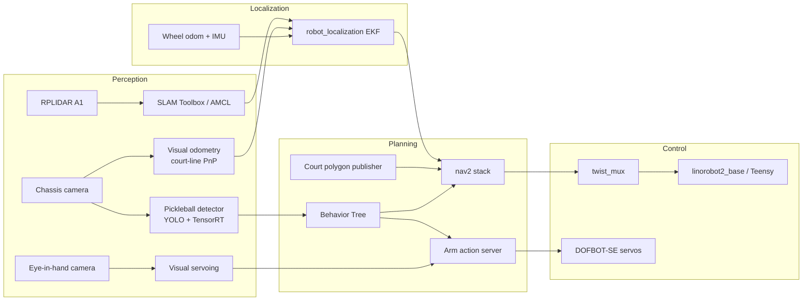
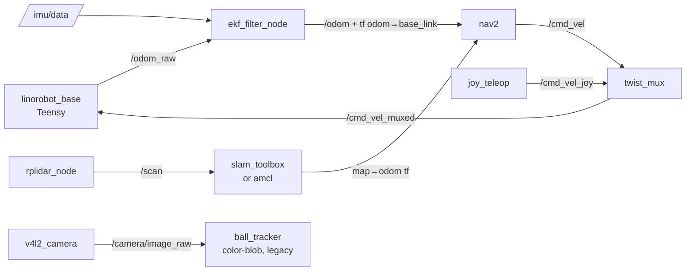
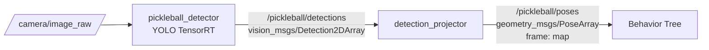
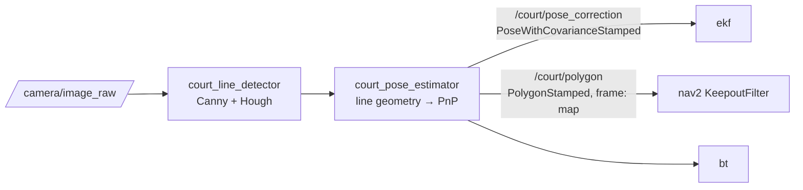
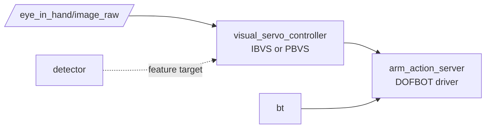
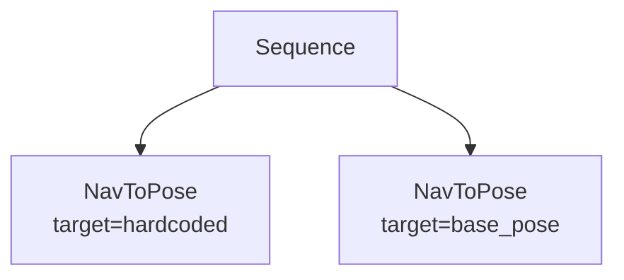
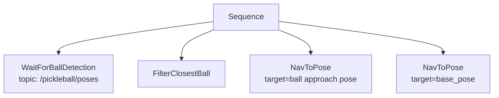
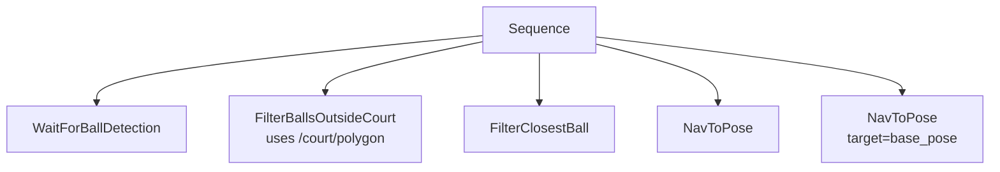
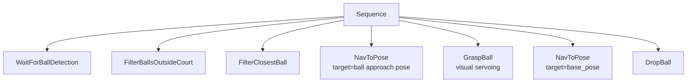
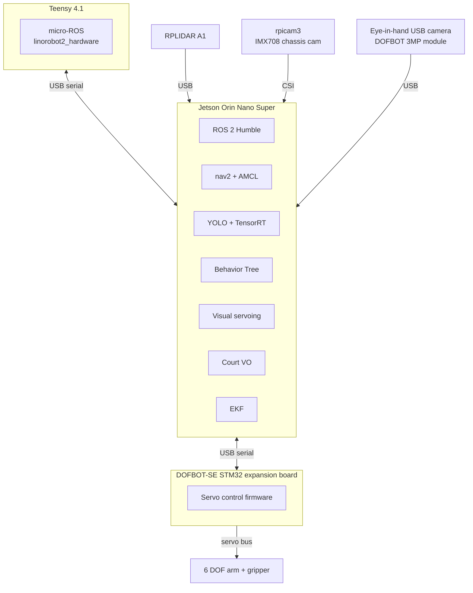

# BallBot v2 Architecture

Reference architecture for the v2 redesign — pickleball ball-retrieval robot with onboard arm, swap from RPi 4 to Jetson Orin Nano Super, indoor + outdoor (court) operation.

This document is the source of truth for system structure. Per-phase task tracking lives in GitHub Issues / Milestones.

> **Naming policy**: the robot's name in prose is **BallBot**, and ROS packages use the `ballbot_` prefix (`ballbot_description`, `ballbot_navigation`, etc.).

---

## 1. System overview

The robot is a 4WD differential-drive base with a 6-DOF arm + gripper mounted on top. It localizes against a 2D lidar map indoors, and against pickleball-court line geometry outdoors (where lidar fails). A learned object detector finds pickleballs in the camera feed; a Behavior Tree orchestrates "find ball → drive to ball → grasp → return to base" while respecting a court keep-out polygon.



---

## 2. Node graph + per-phase deltas

### Baseline (current state, post-revival)



### Adds in M1A/M1B (sim + real nav)

No new nodes — just tuning + map. nav2 + AMCL come up reliably.

### Adds in M2A/M2B (detector)



`detection_projector` lifts 2D pixel detections to 3D poses on the floor plane using known camera extrinsics (no depth cam needed for a ball known to be ground-level).

`ball_tracker` (legacy) stays alongside as a fallback / tuning aid; new BT consumes from `pickleball_detector`.

### Adds in M3A/M3B (visual odometry + court)



VO output is fused into the existing EKF as a pose-correction source (loose coupling). The court polygon is published as a static-layer costmap filter — nav2 plans around it natively.

### Adds in M4A/M4B (manipulation)



### Adds in M5 (final integration)

No new nodes — BT v3 reaches its full form, ties everything together.

---

## 3. TF frame tree

Target tree after v2 design (M0 deliverable). New frames in **bold**.

```
map
└── odom                            [from EKF]
    └── base_link
        ├── lidar_link
        ├── chassis_camera_link
        ├── imu_link
        ├── wheel_{fl,fr,rl,rr}_link
        └── arm_base_link           ← new in v2
            └── shoulder_link       ← new in v2
                └── upper_arm_link  ← new in v2
                    └── forearm_link← new in v2
                        └── wrist_link ← new in v2
                            └── gripper_link ← new in v2
                                ├── eye_in_hand_camera_link ← new in v2
                                └── depth_camera_link ← placeholder, zero-mass
```

Notes:
- `map` → `odom` published by AMCL (indoor) or by VO fusion (outdoor at court).
- `odom` → `base_link` published by `ekf_filter_node`.
- Static transforms for sensor mountings live in URDF.
- `eye_in_hand_camera_link` calibration to `gripper_link` is hand-eye calibration (Phase 4).

---

## 4. Topic + message contracts

Load-bearing custom topics. Standard ROS topics (`/scan`, `/odom`, `/cmd_vel`, `/tf`, etc.) follow ROS conventions and aren't documented here.

| Topic | Message type | Publisher | Subscribers | Notes |
|---|---|---|---|---|
| `/pickleball/detections` | `vision_msgs/Detection2DArray` | `pickleball_detector` | `detection_projector` | Per-frame 2D bounding boxes + confidence |
| `/pickleball/poses` | `geometry_msgs/PoseArray` | `detection_projector` | BT, RViz | Ball positions in `map` frame, ground-plane projected |
| `/court/polygon` | `geometry_msgs/PolygonStamped` | `court_pose_estimator` | nav2 KeepoutFilter, BT | Court-edge polygon in `map` frame, defines keep-out |
| `/court/pose_correction` | `geometry_msgs/PoseWithCovarianceStamped` | `court_pose_estimator` | `ekf_filter_node` | VO pose against court lines, fused into EKF |
| `/bt/state` | `std_msgs/String` (custom later) | `behavior_tree_navigator` | logs, RViz panel | Current BT node + status |
| `/grasp/target_pose` | `geometry_msgs/PoseStamped` | BT | `visual_servo_controller` | Pose of target ball in `gripper_link` approach frame |
| `/arm/joint_states` | `sensor_msgs/JointState` | DOFBOT driver | RViz, MoveIt | Standard arm state |

DDS profile remains FastDDS with the custom XML at `ballbot_base/config/fastrtps.xml` (see existing `bringup.launch.py`).

---

## 5. Behavior Tree decomposition

Each phase ends with a BT extension. The BT lives in a new package (suggested: `ballbot_behavior`) and uses `nav2_behavior_tree` for action plumbing.

### BT v0 — end of M1B
"Drive to a point and come home."



### BT v1 — end of M2B

"Find a ball and drive to it; come home."



### BT v2 — end of M3B

"Same, but only fetch balls outside the court polygon."



The keep-out is enforced two ways: (a) **at the planner**, via the static-layer costmap filter — robot physically can't enter the court area; and (b) **at the BT**, via `FilterBallsOutsideCourt` — robot doesn't even *try* to fetch balls that are on the court. Defense in depth.

### BT v3 — end of M4B

"Pick up the ball and drop it at base."



Failure handling (retry, timeout, give-up) added as decorators in M5.

---

## 6. Deployment topology

Compute target: **Jetson Orin Nano Super Developer Kit** (67 INT8 TOPS, 8 GB LPDDR5, 102 GB/s, 7–25 W). This is generations beyond the original Jetson Nano B01 — single-host topology is comfortable.



- **Teensy 4.1**: motor PWM, encoder reading, IMU reading, `cmd_vel` consumer, `odom_raw` producer. Unchanged from v1.
- **DOFBOT-SE STM32 expansion board**: platform-agnostic abstraction layer for arm control. USB-serial boundary keeps the arm portable across host computers. **Not bypassed** — bypassing turns this into a firmware project.
- **Jetson Orin Nano Super**: everything else. Replaces RPi 4.
- The RPi 4 is retired in v2. With Orin Nano Super's compute headroom, distributed compute (RPi 4 as sidecar) is no longer needed for performance reasons, though it remains an option as a fun side experiment.

---

## 7. Package layout (target)

| Package | Role | Status |
|---|---|---|
| `ballbot_description` | URDF, meshes, onshape-to-robot pipeline | major rework in **M0.1** (resurrect catbot_description CAD pipeline + simplified collisions); v2 design changes in M0.2 |
| `ballbot_base` | Base driver config (linorobot2 fork), EKF, twist_mux | exists, minimal v2 changes |
| `ballbot_bringup` | Launch files for real + sim | exists, extended per phase |
| `ballbot_gazebo` | Sim worlds, plugins | exists, new pickleball court world in M3A; may absorb `obstacles.world` from `archive/catbot_simulation` |
| `ballbot_navigation` | nav2 + AMCL config + maps | exists, retuned in M1A/M1B |
| `ballbot_vision` | Detector node + dataset tools | exists, gains YOLO + TensorRT in M2 |
| `ballbot_perception` (new) | Court line detection, VO, court polygon publisher | M3A |
| `ballbot_manipulation` (new) | Visual servoing, arm action server, grasp | M4A |
| `ballbot_behavior` (new) | Behavior tree XMLs + custom BT nodes | M1B onward |
| `ball_tracker` (legacy) | Color-blob detector | retained as fallback / tuning aid |
| `archive/catbot_description` | Onshape-to-robot pipeline + CAD-derived URDF | **source material for M0.1 migration**; archive can be deleted after merge |
| `archive/catbot_simulation` | Older standalone Gazebo launch + `obstacles.world` | source for `obstacles.world` only; rest superseded by `ballbot_gazebo` |

---

## 8. Open architectural questions

These are explicit unresolved decisions. Each will move out of this section as it's decided (with rationale captured wherever the decision lives in the doc).

1. **Depth camera — yes or no, where?** Skip in v2 per current plan; mono visual servoing for manipulation. Add only if mono stalls. If added, **mounts on the arm (eye-in-hand)**, not chassis — chassis depth gives marginal nav benefit, eye-in-hand depth massively simplifies grasp. CAD: leave clearance + mounting holes on the arm; URDF: leave a `depth_camera_link` frame defined with zero mass placeholder. *Status: tentatively no, eye-in-hand if added.*
2. **Visual servoing — IBVS or PBVS?** IBVS = simpler, image-space loop closure, robust to camera calibration error, doesn't need explicit 3D pose estimate. PBVS = explicit 3D loop, easier to integrate with motion planning. Decide before M4A. *Status: open.*
3. **nav2 controller — DWB or MPPI?** MPPI is newer, smoother, samples thousands of trajectory rollouts. With Orin Nano Super's compute, MPPI is no longer compute-prohibitive. DWB is the safer-tested default. Decide during M1A. *Status: open, leaning MPPI.*
4. **VO + AMCL fusion strategy** — Fuse VO always (loose EKF coupling), or switch on/off based on environment (indoor=AMCL, outdoor=VO)? Loose fusion is simpler; switching is more correct but adds state. *Status: tentatively loose fusion always.*
5. ~~**Compute topology — single Jetson or distributed?**~~ **CLOSED**: single Jetson Orin Nano Super. 67 INT8 TOPS comfortably handles nav + inference + servoing simultaneously. Distributed remains a fun side experiment, not a requirement.
6. **Detector replacement** — Does the new YOLO detector replace `ball_tracker` entirely, or live alongside? Currently planned alongside (legacy as fallback / tuning aid). Revisit after M2B confidence. *Status: alongside.*
7. **Eye-in-hand camera type** — DOFBOT-SE ships with a USB camera + bracket. Orin Nano Super CSI port is available and supports rpicam3. USB is simpler / arm-supplied; CSI gives lower latency + better quality. *Status: tentatively use the supplied USB cam to start, swap if quality drives a need.*
8. **Map storage strategy** — Single static apartment map, or session-rebuilt? Pickleball court geometry is *known*, so the court "map" is just the published polygon, not a SLAM map. Indoor map is static (saved). *Status: indoor static, outdoor geometric.*
9. **Search behavior between fetches** — How does the robot wait for a ball to come into view? Options: (a) park at a chosen vantage point, chassis cam pointed at court; (b) low-rate patrol along the sideline; (c) park + active pan/tilt scan with a 2-DOF camera platform (see #10). Doesn't change architecture — only the BT search subtree. *Status: deferred; pick (a) park-at-corner as v1 placeholder.*
10. **Pan/tilt camera platform** — Optional 2-DOF servo platform for the chassis camera. Battery-cheap (servos <1W) vs. driving (motors 5-20W) — could change the search strategy from patrol to park-and-scan. Would add a `pan_tilt_controller` node + `gimbal_link` TF frame *if* installed. *Status: deferred. No URDF placeholder reserved — adding the link later is a 5-minute change, no need to carry the complexity now.*
11. **DOFBOT-Pro firmware/code reuse** — DOFBOT-Pro is a parallel SKU with same expansion board and confirmed Orin Nano Super support. **Confirmed**: Yahboom ships a complete URDF (`SystemFile_OrinNANOSUPER`) plus ROS code for this configuration. *Status: closing — submodule both `dofbot-pro` and `dofbot-se` into `third_party/`, compose the Pro URDF for the arm in v2 instead of re-CADing.*

12. **STM32 bypass: direct I2C from Orin to expansion board** — DOFBOT-Pro evidence: the Orin Nano Super connects directly to the arm expansion board via 2 GPIO pins (I2C) over a ribbon cable, bypassing USB serial entirely. Trade-offs: lower latency, fewer cables, no host-portable abstraction layer. The DOFBOT-SE STM32 path remains as a fallback. *Status: investigation issue in M0.2; decision must precede M0.2 CAD work since it affects cable routing and plate cutouts.*

---

## 9. Decision log

- **2026-05-10** — Compute target is Jetson Orin Nano Super (not Jetson Nano B01). 67 INT8 TOPS, 8 GB. Closes open question 5 (single-host topology).
- **2026-05-10** — DOFBOT-SE STM32 expansion board kept in the loop; not bypassed. USB-serial is the host-arm boundary. Reason: keep the arm portable, avoid a firmware project as a side quest.
- **2026-05-10** — Eye-in-hand camera placement, not chassis, if depth ever gets added. Reason: chassis depth gives marginal nav benefit; eye-in-hand depth massively simplifies grasp.
- **2026-05-10** — Search-behavior decision deferred. v1 placeholder: park-at-corner with chassis cam pointed at court. BT search subtree is the only thing that changes when this is decided.
- **2026-05-10** — Pan/tilt gimbal: deferred entirely, no URDF placeholder. Adding the link later is trivial; carrying it now is premature complexity.
- **2026-05-10** — M0 split into M0.1 (URDF foundation migration from `archive/catbot_description`) and M0.2 (v2 CAD design changes). Reason: keeps the v2 design changes a "rerun the import" instead of "rebuild the URDF system," and protects against future CAD churn.
- **2026-05-10** — Robot's prose name is "BallBot." All `brobot_*` ROS packages renamed to `ballbot_*` to match (reverses an earlier same-day call to defer the rename).
- **2026-05-10** — Yahboom DOFBOT-Pro URDF (`SystemFile_OrinNANOSUPER`) + ROS code adopted as source for the arm in v2. Re-CADing the arm in Onshape is unnecessary; compose Pro URDF + own chassis CAD instead. Closes open question 11.
- **2026-05-10** — Yahboom code distribution reality: GitHub repos host only PDFs (tutorials, courses). Source code (URDFs, ROS nodes, system images) is on Google Drive only — link in `Annex_Download_Link.txt`. Practical impact: submodule the GitHub repos for tutorial PDFs; do a manual Drive pull for code into `third_party/dofbot-pro-code/`.
- **2026-05-10** — STM32 bypass investigation slated for M0.2 (must precede CAD changes). DOFBOT-Pro firmware exists for direct Orin-to-expansion-board I2C. Decision affects cable routing.
- **2026-05-10** — `archive/catbot_description/` and `archive/catbot_simulation/` to be deleted after M0.1 merge. Git history preserves; `obstacles.world` absorbed into `ballbot_gazebo` if useful.
- **2026-05-10** — Repo layout: `third_party/` at root for code submodules (Yahboom repos); `docs/third_party/` for documentation (datasheets, tutorials). Two separate domains.
- **2026-05-10** — Roadmap moved to `docs/ROADMAP.md`. Refinement happens by editing that file, not by re-dumping in chat.

---

## 10. Glossary

- **AMCL** — Adaptive Monte Carlo Localization. Standard nav2 localizer using a particle filter against a known map.
- **BT** — Behavior Tree. Hierarchical control flow for robot autonomy. Used by nav2 natively.
- **DOFBOT-SE** — Yahboom 6-DOF servo arm + gripper.
- **EKF** — Extended Kalman Filter. Used here via `robot_localization` to fuse odometry + IMU + (later) VO.
- **IBVS / PBVS** — Image-Based / Position-Based Visual Servoing. Two flavors of arm closed-loop control from camera feedback.
- **MPPI** — Model Predictive Path Integral. nav2 controller; samples thousands of trajectory rollouts per cycle.
- **PnP** — Perspective-n-Point. Algorithm: given known 3D points and their 2D image projections, solve for camera pose.
- **TensorRT** — NVIDIA inference runtime. Required for real-time YOLO on Jetson.
- **VO** — Visual Odometry. Estimating motion / pose from a sequence of camera images.
- **YOLO** — "You Only Look Once." Object detection model family.
